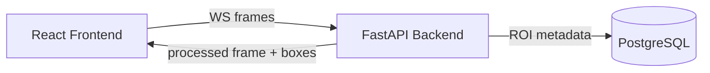
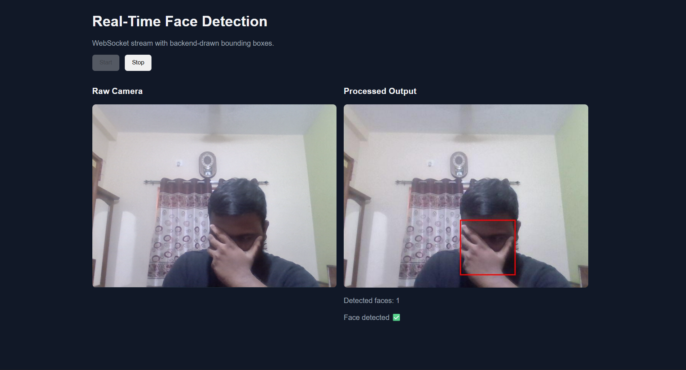

# Real-Time Face Detection Video Streaming System

## One-command run
```bash
docker-compose up --build
```

## Open in browser
`http://localhost:5173`

## Sanity check
```bash
curl http://localhost:8000/roi
```

Tested on:
- Docker v24+
- Node v18+
- Python 3.11

Production-grade but pragmatic evaluation project using FastAPI, WebSockets, MediaPipe (no OpenCV), PostgreSQL, React, and Docker Compose.

## Folder structure

```text
.
├── backend
│   ├── app
│   │   ├── api/routes
│   │   ├── core
│   │   ├── db
│   │   ├── models
│   │   ├── repositories
│   │   ├── schemas
│   │   ├── services
│   │   └── main.py
│   ├── tests
│   ├── Dockerfile
│   └── requirements.txt
├── frontend
│   ├── src
│   ├── Dockerfile
│   └── package.json
├── docker-compose.yml
└── README.md
```

## API design

- `POST /stream/start` -> initializes session
- `WS /stream` -> real-time frame pipeline
- `GET /roi` -> historical ROI data

### `POST /stream/start`
Request:
```json
{
  "source_name": "webcam"
}
```

Response `201 Created`:
```json
{
  "status": "started",
  "session_id": "uuid"
}
```

### `WS /stream`
Incoming frame:
```json
{
  "frame_id": 1,
  "session_id": "uuid",
  "image_base64": "data:image/jpeg;base64,..."
}
```

Outgoing frame:
```json
{
  "frame_id": 1,
  "image_base64": "base64-jpeg-with-boxes",
  "rois": [{"x": 10, "y": 20, "width": 100, "height": 120}],
  "message": null
}
```

If no face is detected:
- Frame is still returned to the client
- ROI is not stored in PostgreSQL for that frame

### Standard error format
```json
{
  "error": {
    "code": "INVALID_FRAME",
    "message": "Invalid image payload"
  }
}
```

Used for WebSocket validation, processing failures, and rate-limit drops.

### `GET /roi`
Returns recent ROI rows.
```bash
curl "http://localhost:8000/roi?limit=10"
```

## Database schema

Table: `roi_data`
- `id` (PK)
- `timestamp`
- `x`
- `y`
- `width`
- `height`
- `frame_id`
- `session_id`

Indexes:
- `ix_roi_data_timestamp`
- `ix_roi_data_frame_id`
- `ix_roi_data_session_id`

DB writes are wrapped in safe transactions via SQLAlchemy session lifecycle (commit on success, rollback on failure).

## Architecture



Frontend captures frames and sends over WebSocket.  
Backend detects faces, stores ROI metadata, and streams processed frames back.  
PostgreSQL stores historical ROI data for REST queries.

## Error handling

Handled:
- invalid frame payload / invalid image base64
- no face detected in frame
- database failures
- WebSocket disconnect
- frame-rate limit exceeded (frame dropped)

## Security fundamentals

- strict Pydantic validation
- max payload size (`MAX_FRAME_BYTES`)
- env-based configuration (no hardcoded secrets)
- CORS restriction
- CORS is configurable via environment variables for flexibility across environments
- basic WebSocket FPS throttling (`MAX_WS_FPS`)

Basic rate limiting is implemented; production systems should enforce per-client throttling and auth.

## Testing

Tests included (`pytest`):
- API test for `POST /stream/start`
- ROI repository storage test
- WebSocket round-trip test (`connect -> send frame -> receive response`)

Run:
```bash
docker-compose run --rm backend pytest
```

## Design choices

- Single service instead of microservices -> simpler and easier to review.
- No message queue -> unnecessary for the single-stream evaluation assumption.

## Known Limitations

- Assumes a single face per frame
- No horizontal scaling for WebSocket connections
- Basic rate limiting (per connection) instead of distributed throttling
- No authentication layer (out of scope for evaluation)

These trade-offs were made intentionally to keep the system simple and aligned with evaluation scope.

## Future Improvements

- Add authentication (JWT/session-based)
- Introduce distributed rate limiting (Redis)
- Support multiple faces per frame
- Add horizontal scaling with load-balanced WebSocket servers
- Store frames or metadata in object storage (e.g., S3)

## Suggested commit history

1. `chore: initialize project scaffold and compose setup`
2. `feat: add FastAPI app with stream and roi routes`
3. `feat: integrate mediapipe face detection without opencv`
4. `feat: add session-based ROI persistence with sqlalchemy`
5. `feat: add react client for webcam streaming and output preview`
6. `test: add api, websocket, and repository pytest coverage`
7. `docs: add quickstart, architecture diagram, and ai disclosure`

## `git log --oneline` (example target)

```bash
a1b2c3d docs: add quickstart, architecture diagram, and ai disclosure
d4e5f6a test: add api, websocket, and repository pytest coverage
123abcd feat: add react client for webcam streaming and output preview
456efgh feat: add session-based ROI persistence with sqlalchemy
789ijkl feat: integrate mediapipe face detection without opencv
mnopqrs feat: add FastAPI app with stream and roi routes
tuvwxyz chore: initialize project scaffold and compose setup
```

## AI usage disclosure

Generated with AI assistance:
- initial scaffolding
- API/service/repository boilerplate
- Docker and README draft

Validation performed:
- manual requirement-by-requirement review
- added API, repository, and WebSocket tests
- checked constraints (no OpenCV, monolithic design, env-driven config)

## Screenshot (recommended for evaluation)

Add a real screenshot of the running UI (video + bounding box), then place it at `docs/screenshot.png` and include:

```markdown

```
